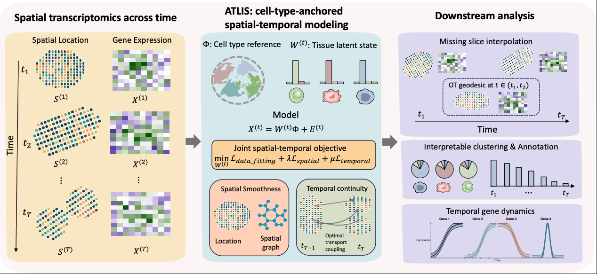

# ATLIS: Anchored Tissue Landscape in Interpretable Space

ATLIS is an interpretable spatial–temporal modeling framework in which cell-type composition defines an interpretable latent space that anchors spatial organization and temporal evolution in multi-slice spatial transcriptomics data.

Installation
------------
You can install the released version of ATLIS from Github with the following code:

`git clone https://github.com/WenjunZHAOwO/ATLIS.git`

Example usage
------------
[Synthetic example notebook](https://github.com/WenjunZHAOwO/ATLIS/blob/main/Scripts/Synthetic.ipynb)

How to cite`ATLIS`
-------------------
Wenjun Zhao# and Ying Ma#, ATLIS: Anchored Tissue Landscapes in an Interpretable Latent Space. 2026

